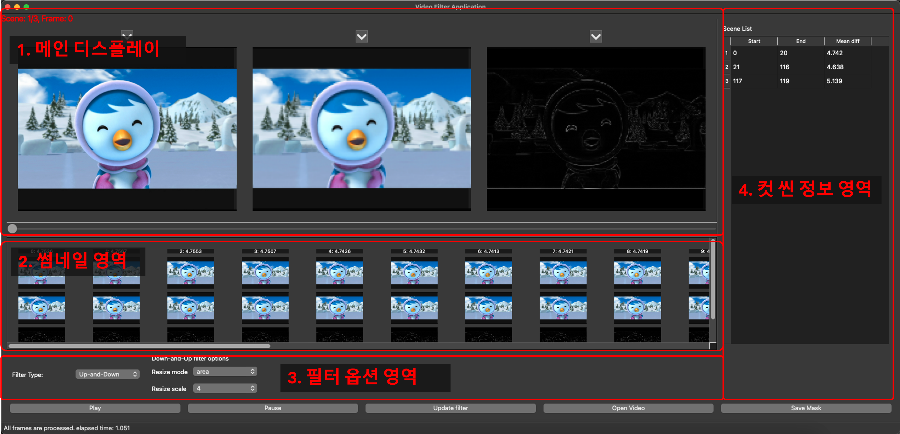
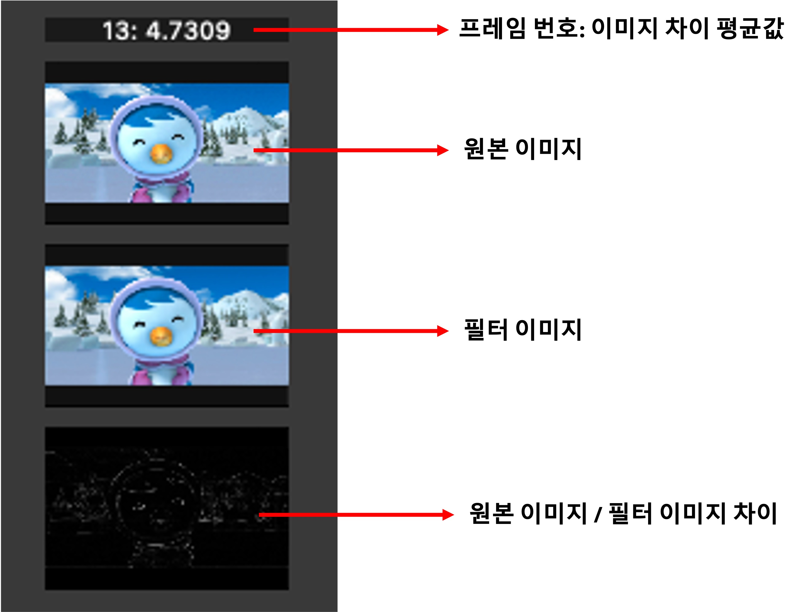

Window 환경에서는 아직 테스트를 안해봐서 실행결과가 조금 다를 수 있습니다.

버그가 발견될 경우 Issue 란에 작성해주세요.

# 사용 방법

## 1. Installation

### **1-1. ffmpeg 설치**

**Windows에서 ffmpeg 설치**

1. **ffmpeg 다운로드**
    - [공식 사이트](https://ffmpeg.org/download.html) → Windows → "Windows builds from gyan.dev" 클릭
    - "git master builds" 섹션에서 **"ffmpeg-git-full.7z"** 또는 **"ffmpeg-git-essentials.7z"** 다운로드
2. **압축 해제 및 폴더 설정**
    - 다운로드한 `.7z` 파일을 압축 해제
    - `ffmpeg` 폴더를 `C:\ffmpeg` 또는 원하는 위치에 이동
3. **환경 변수 설정**
    - `C:\ffmpeg\bin` 경로를 시스템 PATH에 추가
        1. `Win + R` → `sysdm.cpl` 입력 후 Enter
        2. "고급" 탭 → "환경 변수" 클릭
        3. "시스템 변수"에서 `Path` 선택 후 "편집" 클릭
        4. 새 항목 추가 (`C:\ffmpeg\bin`) 후 확인
4. **설치 확인**
    - `cmd` 또는 `PowerShell`을 열고 다음 명령 실행:
        
        ```bash
        ffmpeg -version
        ```
        
    - 버전 정보가 출력되면 정상적으로 설치된 것입니다.

**macOS에서 ffmpeg 설치**

1. **Homebrew를 이용한 설치 (권장)**
    
    ```bash
    brew install ffmpeg
    ```
    
2. **설치 확인**
    
    ```bash
    ffmpeg -version
    ```
    

### 1-2. Package 설치

```python
git clone https://github.com/jhoowy-inshorts/Monitor_noise
cd Monitor_noise

pip install -r requirements.txt
```

## 2. Config Setting (Optional)

- 현재 Config File은 다음과 같이 구성되어 있습니다.
- 현재는 프로그램 optimization을 위한 설정, Scene Boundary detection 설정, Filter 옵션 설정으로 구성되어 있습니다.

```yaml
GENERAL_OPTIONS:
    worker_num: 8 # 동영상 처리에 사용될 thread 개수
    batch_size: 25 # Thumbnail 영역에서 한 번에 Load 할 이미지 개수

SCENE_DIVIDE_OPTIONS:
    model_name: scenedetect # [scenedetect, transnetv2]

FILTER_OPTIONS:
    filter_type: DOWN_AND_UP
    filter_opts:
        down_and_up: # Down sampling 후, Upsampling
            scale: 4 # Resize scale
            mode: 'area' # Resize 과정에서 사용할 interpolation 옵션
        nl_denoise:
            filter_h: 7
```

- batch size: 썸네일 영역에서 한 번에 Load 할 이미지 개수 (총 batch_size * 2개 표시)
    - 너무 크게 설정하면 썸네일 이동시 느려질 수 있습니다.
- filter_type: DOWN_AND_UP, NL_DENOISE 중 선택
    - **03-20 기준 DOWN_AND_UP 만 지원하고 있습니다**

## 3. 실행방법

- 아래 커맨드로 GUI를 띄울 수 있습니다.

```bash
python main.py
```

### Main UI 설명

- 실행시 다음과 같은 화면이 나옵니다.



1. **메인 디스플레이**
    - 화면 왼쪽 위에 현재 Scene 및 프레임이 표시됩니다.
    - 접기 버튼을 누르면 해당하는 이미지를 숨길 수 있습니다.
    - 좌측부터 순서대로 **[원본 이미지, 필터링된 이미지, 원본 이미지와의 차이]** 입니다.
    - 이미지를 클릭하면 썸네일 영역이 해당 이미지 위치로 이동합니다.
    - 이미지 하단 슬라이더로 원하는 동영상 위치로 이동할 수 있습니다. (재생 바)

1. **썸네일 영역**
    
    
    
    - 각 프레임에 대한 미리보기가 표시됩니다.
    - 프레임 클릭 시 해당 프레임으로 메인 디스플레이가 업데이트 됩니다.
    - 스크롤을 끝까지 옮긴 뒤 떼면 인접한 프레임의 썸네일을 불러옵니다.
    - **영상 처리가 전부 진행되지 않으면 썸네일 영역이 검은색으로 보일 수 있습니다.**
    - **썸네일 사이 공간을 누르면 씬 분할 / 병합이 가능합니다.**

1. **필터 옵션 영역**
    - 필터 옵션을 통해 적용될 필터 옵션 값을 설정할 수 있습니다.
    - 현재는 Down-and-up 필터만 적용 가능합니다.
        - 주어진 Resize 옵션으로 Downsampling 후 원본 사이즈로 되돌립니다.
    - **필터 옵션 변경 후 “Update Filter” 버튼을 눌러야 적용이 됩니다.**

1. **컷 씬 정보 영역**
    - 자동으로 검출된 씬 경계가 표시됩니다.
        - **영상 로드 후 시간이 어느 정도 지나야 업데이트가 됩니다.**
    - 영상 구간 별로 평균 차이가 업데이트 됩니다.

### 단축키

- Spacebar: 영상 재생 / 중단
- ↑ : 다음 씬으로 이동
- ↓ : 이전 씬으로 이동
- → : 다음 프레임으로 이동
- ← : 이전 프레임으로 이동

## 업데이트 예정 기능

- [x]  Cut 분할 기능
    - Description
        - 우선 Automatic 하게 영상의 cut 분할
        - 사용자가 잘못된 분할을 교정할 수 있게 구현
        - 컷 별로 필터 점수 평균
        - Thumbnail 리스트에 컷 분할 지점 노란색으로 나타내고
        - 해당 지점 클릭하면 컷 분할 제거 / 삽입
        - 위 아래로 이동
- [x]  긴 동영상 지원
    - Description
        - 현재 너무 긴 영상은 Load 할 때 너무 오래걸리고 out-of-memory 발생할 위험이 높음
        - Maximum load size 설정 및 구간 전환 가능하도록 변경
            - 현재 보고있는 구간을 center로 하여 구간을 동적으로 수정할 수도 있긴 한데 작업량이 너무 많아질 듯
            - 이 구현은 잘 할줄 아는 사람한테 맡기는게 효율적이라 생각됨